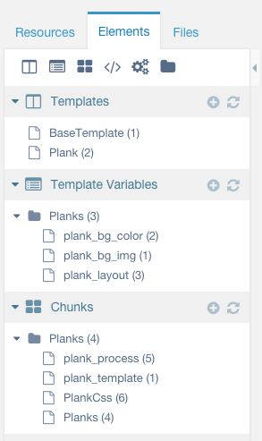
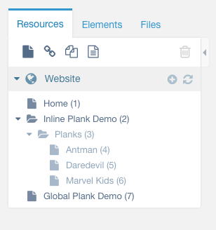
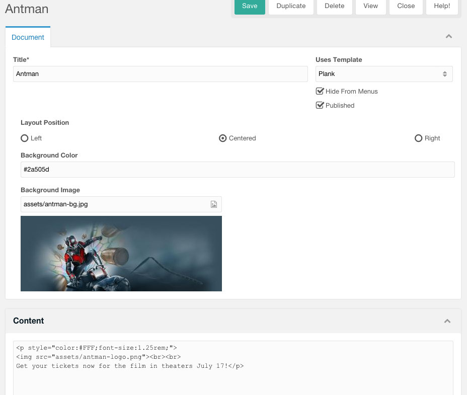

# MODX-Planks
How to create front end design planks in MODX

## Video Tutorial

Visit my YouTube page at: http://youtu.be/HySYpgjh0Gs

## Setup

1. Install getResources Extra
2. Install the Transport Package in this repo
3. Check you have a `Plank Template` (its empty)
4. Check you have 3 Plank Template Variables
5. Check you have 4 Plank Chunks 



---

1. Create a `Hidden` but `Published` Plank Folder under the resource you want Planks in OR create a Plank Folder wherever you want if your using the Global Feature.
2. Planks are `Hidden` so they dont show up in Search or Sitemaps or Menus



---

## Create your Planks




> If you want the customized manager page look go to Settings > Manager Customizations (Form Customizations) -> Click "Create New Profile" > Name it "Planks" -> Inside that you will see "Import New Set from XML" -> Import the XML file in this repo


---

**Add the Plank CSS to your stylesheet or call it in your Base Template**

---

## MODX Chunk Calls

`[[$Planks]]` for inline/nested planks

```[[$Planks? &group=`3`]]```

For Global Planks
